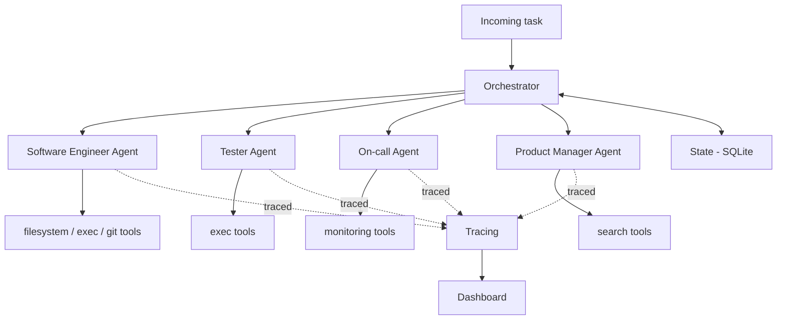

# Architecture

## Overview

## Components

- **Orchestrator** — decomposes an incoming task, routes subtasks to agents,
  persists progress to state so long-running tasks survive a restart.
- **Agents** — each subclasses `BaseAgent`'s step-limited loop and only supplies
  its own system prompt and tool set.
- **Tool registry** — single source of truth for tool JSON schemas (sent to the
  LLM) and the Python callables that actually run when a tool is invoked.
- **Guardrails** — validates every action *before* execution: allow-listed
  filesystem paths, forbidden shell commands, per-task step ceilings.
- **Tracing** — logs every tool call with tokens, cost, and latency; feeds the
  dashboard and the eval harness's cost metrics.
- **Eval harness** — golden dataset of tasks plus LLM-as-judge scoring, so the
  project demonstrates production-readiness rather than just a demo.

## Why a provider-agnostic LLM client

`llm_client.py` normalizes Gemini's, Anthropic's, and OpenRouter's
(OpenAI-compatible) tool-use APIs into one `LLMResponse` shape. Agents only
ever call `call_with_tools()` — they don't know or care which provider
answered. This means:

- Development happens for free against a Gemini or OpenRouter key.
- Switching providers (e.g. one provider's free tier is exhausted for the
  day, or for a cost/quality comparison) is a one-line env var change, not
  a rewrite.

One real structural difference surfaced when adding the third provider:
Anthropic and Gemini bundle multiple tool results from one step into a
single combined turn, but OpenAI-style APIs require a *separate* message
per tool result. `to_assistant_turn` / `to_tool_result_turn` both return a
list of turns rather than one turn for exactly this reason — the agent
loop always `.extend()`s, so the difference in cardinality is invisible to
`base_agent.py`. Weaker free models are also more likely to return
malformed JSON in a tool call's arguments than Gemini or Claude; rather
than let that crash the task, `_call_openrouter` packages it as a marked
argument that the existing tool-error isolation in `_execute_tool` turns
into a normal error result the model can see and recover from.

## Resilience, guardrails & tracing (Phase 1-2)

Giving an LLM real tool access — even just to one machine, for one agent —
means a few failure modes need handling before the happy path matters:

- **Rate limits & transient errors.** `call_with_tools` retries on HTTP 429
  and 5xx with exponential backoff + jitter, capped at a small number of
  retries. A 429 from a daily quota being exhausted won't resolve itself by
  waiting a few seconds, so this fails fast after `MAX_RETRIES` rather than
  hammering the API.
- **Token/cost budget**, tracked separately from step count — a single large
  tool result (e.g. reading a big file) can blow a budget without using many
  steps.
- **Task-level wall-clock timeout**, independent of step count — bounds how
  long one task can run in total, on top of the per-step model call.
- **Repetition guard** — if the model requests the exact same tool call
  several times in a row, the loop stops instead of burning budget on a
  stuck agent.
- **Tool execution errors are isolated.** A failing tool (missing file, bad
  args, command timeout) becomes an error result sent back to the model,
  not a crashed task — the model gets a chance to adapt and, in practice,
  often does (see the fizzbuzz example in the project history: the agent
  ran pytest, read the failure, fixed the bug, and re-ran tests on its own).
- **LLM call errors are isolated the same way.** This one wasn't there from
  the start — it surfaced when a real orchestrator run hit Gemini's daily
  quota mid-task: the exception escaped `call_with_tools` after retries
  were exhausted and crashed the whole process with a raw traceback,
  despite the resumability machinery in `state.py` already being able to
  handle exactly this case. `BaseAgent.run()` now catches it and returns a
  normal `AgentResult(stopped_reason="api_error", error=...)`, and
  `orchestrator.py`'s own decomposition call gets the same treatment
  (`stopped_reason="decomposition_error"`, with nothing partially saved —
  a retry with the same task_id re-decomposes cleanly). The result: a
  quota/network failure marks one subtask failed and stays resumable,
  instead of taking down the run.
- **Malformed tool-call arguments get an actionable error, not a confusing
  one.** Seen live with `gpt-oss-120b` on OpenRouter: a tool call with
  broken JSON in its arguments used to surface to the model as
  `write_file() got an unexpected keyword argument '_malformed_arguments'`
  — technically informative, but indirect enough that the model gave up
  instead of retrying, silently leaving a subtask's actual deliverable
  unwritten while still reporting `stopped_reason="done"`. `_execute_tool`
  now recognizes this case explicitly and returns "your arguments weren't
  valid JSON, please retry" instead, before the call ever reaches the real
  tool function.
- **Sandboxing**, hardcoded into the tools themselves. Filesystem tools
  resolve every path and reject anything outside the sandbox root
  (including `../` traversal and absolute paths). The exec tool uses
  `shell=False` with `shlex.split` (no shell-metacharacter injection), runs
  with `cwd` fixed to the sandbox, and always has a timeout.
- **Guardrails** (`guardrails.py`), a separate *configurable policy* layer on
  top of the hardcoded sandboxing above — checked before a tool runs, not
  baked into the tool implementation. A deny-list of regex patterns blocks
  commands like `rm`, `sudo`, `git push`, `pip install`; a size limit blocks
  oversized writes. Either one short-circuits before the real tool function
  is ever called.
- **Tool-scope enforcement.** Each agent only sees schemas for its own
  declared `tool_names`, but the shared tool registry holds every tool any
  agent might use. `base_agent.py` defensively re-checks that a requested
  tool name is actually in *this* agent's scope before executing it — a
  hallucinated or scope-confused call is rejected the same way a guardrail
  violation is, not assumed-safe just because it parsed.
- **Tracing** (`tracing.py`) — every LLM call and every tool call (including
  blocked and errored ones) is written as one JSON line to
  `traces/<task_id>.jsonl`: tokens, latency, blocked/error flags, truncated
  input/output. This is what turns "the agent did something for 5 steps and
  I have no idea what" into an inspectable record — and what Phase 5's eval
  harness will pull cost/latency numbers from. $ cost is computed only if
  you fill in current provider pricing via env vars; it's not hardcoded
  here since prices change.

## Task decomposition & resumability (Phase 3)

The orchestrator turns one incoming task into an ordered list of subtasks
and routes each to an agent, checkpointing to SQLite after every subtask:

- **Decomposition is one plain LLM call**, reusing `call_with_tools` with
  an empty tool list rather than a separate code path — retries/backoff
  apply here too. The model is asked for a JSON array of
  `{agent, description}` subtasks.
- **Parsing degrades gracefully, never crashes.** Empty response, malformed
  JSON, wrong shape, an agent name that doesn't exist — any of these falls
  back to a single subtask covering the whole original task. Decomposition
  is a nice-to-have; the task should still run without it.
- **Routing is keyed by agent name** (`AVAILABLE_AGENTS: dict[str, type[BaseAgent]]`),
  currently only `"swe"`. Phase 4 adds Tester/On-call/PM as more dict
  entries — `orchestrator.py` itself doesn't change.
- **Every subtask is checkpointed to SQLite** (`state.py`) before and after
  it runs: `pending -> running -> done|failed`. If the process dies
  mid-subtask, that subtask stays `running` — a resume retries it rather
  than assuming partial work succeeded.
- **Resuming skips re-decomposition entirely.** `run(task, task_id=...)`
  checks for an existing saved plan first; if found, it's reused as-is and
  execution continues from the first subtask not yet `done`. This is the
  property the original project pitch (long-running, restartable agent
  runs) actually depends on — see `scripts/run_orchestrator.py` for how to
  exercise it manually (interrupt it, re-run with the same `--task-id`).

## Role specialization & least privilege (Phase 4)

`tester`, `oncall`, and `pm` join `swe` as routable agents. Two design
choices here are worth calling out:

- **`tester` and `swe` share the same tool names** (read/write/list/
  run_command) — what makes them different roles isn't different tooling,
  it's different *permissions* over the same tools, enforced in
  `guardrails.py` rather than left to the system prompt. `tester`'s
  `write_file` calls are rejected unless the path looks like a test file
  (`test_*.py` / `*_test.py`); `pm`'s are rejected unless it's `.md`. A
  model ignoring its own instructions still can't write to the wrong kind
  of file — the restriction is checked in `base_agent.py`'s
  `_execute_tool`, before the real tool function ever runs, the same place
  every other guardrail is enforced.
- **`oncall` has no `write_file` at all.** Least privilege: don't grant a
  tool a role has no legitimate use for and rely on the prompt to
  discourage using it — just don't grant it. `oncall`'s tools
  (`query_traces`, `health_check`, plus read-only filesystem access) are
  the smallest set that role actually needs.

`oncall`'s `query_traces` tool reads the same JSONL files `tracing.py`
already writes for every other agent's run — there's no fabricated
"production log" concept invented for this role. There's no real deployed
service for a portfolio project to monitor, but there *is* real
operational data already being generated by every other agent run, and
that's exactly what an on-call engineer would actually look at: which
tasks failed, which tool calls got blocked, where the errors were.

`pm`'s `web_search` tool uses DuckDuckGo's keyless Instant Answer API — no
API key or paid subscription needed, at the cost of shallower results (an
abstract/summary, not a ranked SERP). Good enough for background research
before a requirement gets broken down; a real search API would be a
natural upgrade if that turns out to be too shallow in practice.

`AVAILABLE_AGENTS` in `orchestrator.py` is built from each agent class's
own `agent_name` attribute rather than a separately maintained dict
literal — the routing key and the guardrail role check in `guardrails.py`
read the same source of truth, so they can't drift apart from each other.
The decomposition prompt also got richer here: with one agent, just
listing its name was enough context; with four roles, the model needs a
one-line description of each to route sensibly — see `AGENT_DESCRIPTIONS`
in `orchestrator.py`.

## Eval harness (Phase 5)

The motivating example for this whole phase happened live, during manual
testing of Phase 4: an orchestrator run asked the SWE agent to implement
`validate_input`. A malformed tool call meant `write_file` failed; the
model gave up rather than retry, and returned `stopped_reason="done"`
anyway. The orchestrator, which only checks `stopped_reason`, accepted
that as success and moved on. The fact that the implementation was never
actually written only became visible because the *next* subtask (Tester)
happened to notice the file didn't exist. If the pipeline had ended one
step earlier, nothing would have caught it.

**`stopped_reason="done"` means the model stopped calling tools — it does
not mean the task was actually accomplished.** That gap is exactly what an
eval harness exists to close, and the bug above is now one of the ten
golden-dataset tasks (`swe_bugfix`, which seeds a known-broken
`fizzbuzz.py` and verifies via `pytest -q` actually passing, not via
trusting the agent's summary).

- **Verification is mechanical wherever possible** (`eval_runner.py`):
  file existence, file content, exact-content-unchanged, glob-absence, or
  a command's exit code. These are deterministic and free. LLM-as-judge
  (`eval_judge.py`) is the fallback for genuinely qualitative criteria —
  e.g. "is this backlog prioritized with rationale?" — not the default,
  because it's a probabilistic approximation that costs a call.
- **Guardrails get their own golden tasks, not just capability checks.**
  `tester_respects_scope` gives the tester a task explicitly designed to
  tempt it into "helpfully" refactoring `fizzbuzz.py`, then verifies the
  file is byte-identical afterward — testing that the Phase 4 write-path
  restriction actually holds under model behavior, not just that
  `guardrails.check()` returns the right thing in isolation (already
  covered by `test_guardrails.py`). `pm_writes_markdown_only` does the
  same for the PM agent's `.py`-write restriction.
- **Every task runs in its own isolated directory** under
  `eval/runs/<task_id>/` — sandbox, traces, and SQLite state all scoped to
  that one run via `dataclasses.replace(config, ...)`. This exists because
  of another real failure mode hit during manual testing: a leftover
  `test_fizzbuzz.py` from an earlier interactive session confused a later
  one. Eval results need to be reproducible in a way ad hoc testing in the
  shared `./workspace` isn't.
- **The eval harness treats agent-level exceptions as its own bug, not the
  dataset's.** `run_task` wraps the agent/orchestrator call in a try/except
  even though `BaseAgent.run()` is designed to never raise (see above) —
  belt-and-suspenders so one broken task can't take down a whole dataset
  run.

## Status

This document grows alongside the implementation. See the phase table in the
[README](../README.md) for current status.
