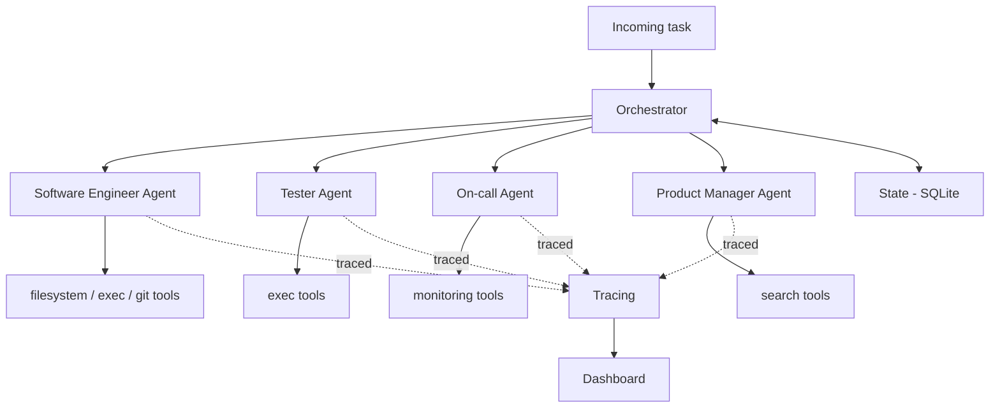

# Architecture

## Overview

## Components

- **Orchestrator** — decomposes an incoming task, routes subtasks to agents,
  persists progress to state so long-running tasks survive a restart.
- **Agents** — each subclasses `BaseAgent`'s step-limited loop and only supplies
  its own system prompt and tool set.
- **Tool registry** — single source of truth for tool JSON schemas (sent to the
  LLM) and the Python callables that actually run when a tool is invoked.
- **Guardrails** — validates every action *before* execution: allow-listed
  filesystem paths, forbidden shell commands, per-task step ceilings.
- **Tracing** — logs every tool call with tokens, cost, and latency; feeds the
  dashboard and the eval harness's cost metrics.
- **Eval harness** — golden dataset of tasks plus LLM-as-judge scoring, so the
  project demonstrates production-readiness rather than just a demo.

## Why a provider-agnostic LLM client

`llm_client.py` normalizes Gemini's and Anthropic's tool-use APIs into one
`LLMResponse` shape. Agents only ever call `call_with_tools()` — they don't
know or care which provider answered. This means:

- Development happens for free against a Gemini key.
- Switching to Anthropic (e.g. for evaluation runs, or a cost/quality
  comparison) is a one-line env var change, not a rewrite.

## Status

This document grows alongside the implementation. See the phase table in the
[README](../README.md) for current status.
