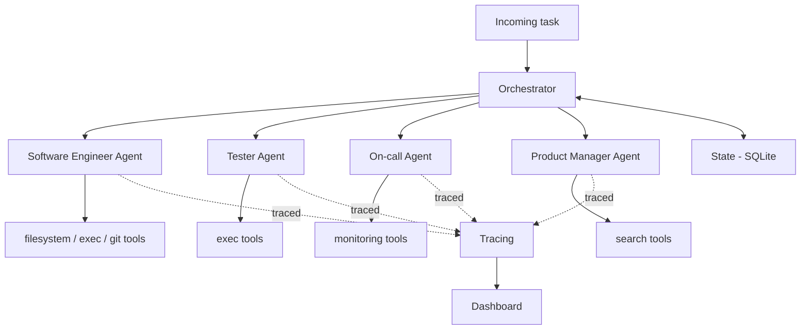

# Architecture

## Overview

## Components

- **Orchestrator** — decomposes an incoming task, routes subtasks to agents,
  persists progress to state so long-running tasks survive a restart.
- **Agents** — each subclasses `BaseAgent`'s step-limited loop and only supplies
  its own system prompt and tool set.
- **Tool registry** — single source of truth for tool JSON schemas (sent to the
  LLM) and the Python callables that actually run when a tool is invoked.
- **Guardrails** — validates every action *before* execution: allow-listed
  filesystem paths, forbidden shell commands, per-task step ceilings.
- **Tracing** — logs every tool call with tokens, cost, and latency; feeds the
  dashboard and the eval harness's cost metrics.
- **Eval harness** — golden dataset of tasks plus LLM-as-judge scoring, so the
  project demonstrates production-readiness rather than just a demo.

## Why a provider-agnostic LLM client

`llm_client.py` normalizes Gemini's and Anthropic's tool-use APIs into one
`LLMResponse` shape. Agents only ever call `call_with_tools()` — they don't
know or care which provider answered. This means:

- Development happens for free against a Gemini key.
- Switching to Anthropic (e.g. for evaluation runs, or a cost/quality
  comparison) is a one-line env var change, not a rewrite.

## Resilience, guardrails & tracing (Phase 1-2)

Giving an LLM real tool access — even just to one machine, for one agent —
means a few failure modes need handling before the happy path matters:

- **Rate limits & transient errors.** `call_with_tools` retries on HTTP 429
  and 5xx with exponential backoff + jitter, capped at a small number of
  retries. A 429 from a daily quota being exhausted won't resolve itself by
  waiting a few seconds, so this fails fast after `MAX_RETRIES` rather than
  hammering the API.
- **Token/cost budget**, tracked separately from step count — a single large
  tool result (e.g. reading a big file) can blow a budget without using many
  steps.
- **Task-level wall-clock timeout**, independent of step count — bounds how
  long one task can run in total, on top of the per-step model call.
- **Repetition guard** — if the model requests the exact same tool call
  several times in a row, the loop stops instead of burning budget on a
  stuck agent.
- **Tool execution errors are isolated.** A failing tool (missing file, bad
  args, command timeout) becomes an error result sent back to the model,
  not a crashed task — the model gets a chance to adapt and, in practice,
  often does (see the fizzbuzz example in the project history: the agent
  ran pytest, read the failure, fixed the bug, and re-ran tests on its own).
- **Sandboxing**, hardcoded into the tools themselves. Filesystem tools
  resolve every path and reject anything outside the sandbox root
  (including `../` traversal and absolute paths). The exec tool uses
  `shell=False` with `shlex.split` (no shell-metacharacter injection), runs
  with `cwd` fixed to the sandbox, and always has a timeout.
- **Guardrails** (`guardrails.py`), a separate *configurable policy* layer on
  top of the hardcoded sandboxing above — checked before a tool runs, not
  baked into the tool implementation. A deny-list of regex patterns blocks
  commands like `rm`, `sudo`, `git push`, `pip install`; a size limit blocks
  oversized writes. Either one short-circuits before the real tool function
  is ever called.
- **Tool-scope enforcement.** Each agent only sees schemas for its own
  declared `tool_names`, but the shared tool registry holds every tool any
  agent might use. `base_agent.py` defensively re-checks that a requested
  tool name is actually in *this* agent's scope before executing it — a
  hallucinated or scope-confused call is rejected the same way a guardrail
  violation is, not assumed-safe just because it parsed.
- **Tracing** (`tracing.py`) — every LLM call and every tool call (including
  blocked and errored ones) is written as one JSON line to
  `traces/<task_id>.jsonl`: tokens, latency, blocked/error flags, truncated
  input/output. This is what turns "the agent did something for 5 steps and
  I have no idea what" into an inspectable record — and what Phase 5's eval
  harness will pull cost/latency numbers from. $ cost is computed only if
  you fill in current provider pricing via env vars; it's not hardcoded
  here since prices change.

## Task decomposition & resumability (Phase 3)

The orchestrator turns one incoming task into an ordered list of subtasks
and routes each to an agent, checkpointing to SQLite after every subtask:

- **Decomposition is one plain LLM call**, reusing `call_with_tools` with
  an empty tool list rather than a separate code path — retries/backoff
  apply here too. The model is asked for a JSON array of
  `{agent, description}` subtasks.
- **Parsing degrades gracefully, never crashes.** Empty response, malformed
  JSON, wrong shape, an agent name that doesn't exist — any of these falls
  back to a single subtask covering the whole original task. Decomposition
  is a nice-to-have; the task should still run without it.
- **Routing is keyed by agent name** (`AVAILABLE_AGENTS: dict[str, type[BaseAgent]]`),
  currently only `"swe"`. Phase 4 adds Tester/On-call/PM as more dict
  entries — `orchestrator.py` itself doesn't change.
- **Every subtask is checkpointed to SQLite** (`state.py`) before and after
  it runs: `pending -> running -> done|failed`. If the process dies
  mid-subtask, that subtask stays `running` — a resume retries it rather
  than assuming partial work succeeded.
- **Resuming skips re-decomposition entirely.** `run(task, task_id=...)`
  checks for an existing saved plan first; if found, it's reused as-is and
  execution continues from the first subtask not yet `done`. This is the
  property the original project pitch (long-running, restartable agent
  runs) actually depends on — see `scripts/run_orchestrator.py` for how to
  exercise it manually (interrupt it, re-run with the same `--task-id`).

## Status

This document grows alongside the implementation. See the phase table in the
[README](../README.md) for current status.
